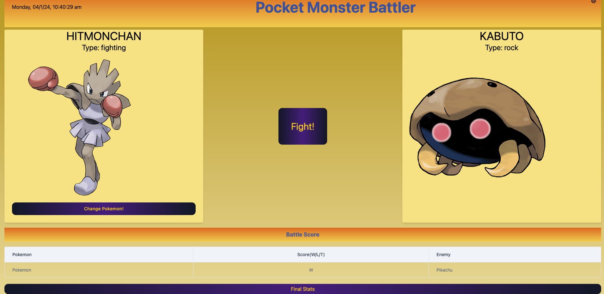
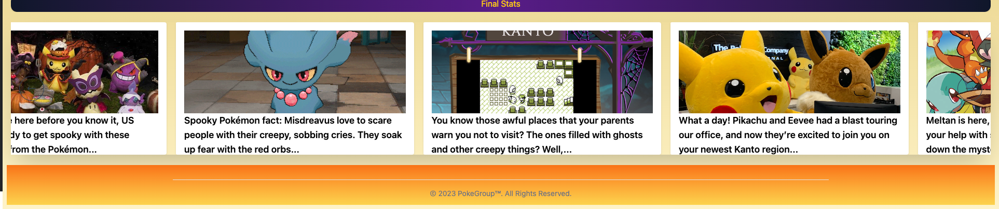

# Interactive Front-End Application: Pocket Monster Battler

## Game Description 
The *Pocket Monster Battler* is an online game that brings the world of Pokémon trading cards to life in a digital format. Players can engage in card battles against a randomly generated opponent, testing their skills and strategy. With a user-friendly interface suitable for all ages, Pocket Monster Battler offers an experience for both seasoned Pokémon trainers and newcomers alike. 

## Technology

* Poke API;
* tumblr API;
* DayJs;
* Tailwind CSS
* Node.js

## Page views

### <u> Initial page view  </u> 

### <u> View after start button is clicked </u> 

Upon clicking start, the user's card will be on the left, with an option to change their Pokemon if they wish. The player plays against randomly generated Pokemon. The battle begins whe the user clicks fight. 

Battle scores are updated live after each fight. When user clicks "Final Stats", they will be taken to a page where they receive their full score and play history.

### <u> tumblr Feed  </u> 

A live feed fetched from tumblr to display relevant Pokemon posts provides an enhanced user experience.

---
© 2024 PokeGroup

